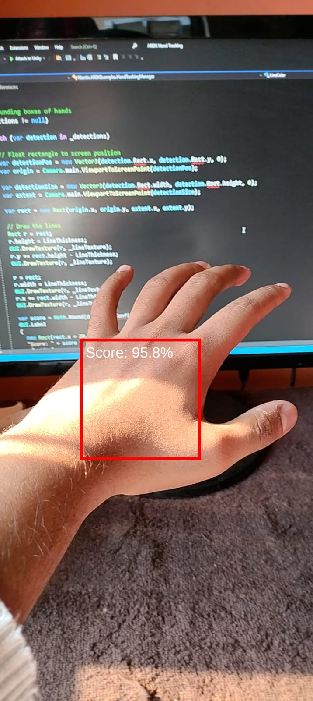

# 💡 Hand Tracking with ARDK
Use hand tracking to track the position of a person’s hand in the frame. Hand tracking performs palm detection and provides information for the 2D position of the hand and the width and height of the hand.ARDK's Hand tracking uses the hand tracking machine learning model from MediaPipe

💡<b>NOTE:</b> Hand Tracking is currently experimental and is not ready for production builds

## ⚒️ Development Tools
* Unity Engine 2021.3.15f1
* Lightship ARDK 2.3.1
* Visual Studio 2019

## ⚒️ Running Locally
Make sure to use Unity 2020 or higher versions for this project to work properly.
* Download [Unity Hub](https://unity3d.com/get-unity/download "Unity Hub")
* Install Unity version 2020 or higher 
</img>
* Install Android Build Support, OpenJDK, Android SDK & NDK Tools
</img>
* Clone the repository `https://github.com/Priyanshu-CODERX/ardk-occlusion-and-meshing.git`
* Open the project with your Unity Engine
* Switch build platform to Android
* Go to project setting's and change the minimum api level to `Android 7.0 API Level 23`
* Switch to Gradle Version higher than 6.7
* Follow the documentation to update AndroidManifest and Base Gradle Template before building the apk
* Build the apk

## ⚒️ Documentations
* [ARDK Hand Tracking](https://lightship.dev/docs/ardk/experimental/hand_tracking.html "ARDK Hand Tracking")
* [MediaPipe Model Card](https://drive.google.com/file/d/1-rmIgTfuCbBPW_IFHkh3f0-U_lnGrWpg/preview "MediaPipe Model Card")
* [Building For Android](https://lightship.dev/docs/ardk/ardk_fundamentals/building_android.html#doxid-building-android)

## 💡 Meshing and Occlusion
